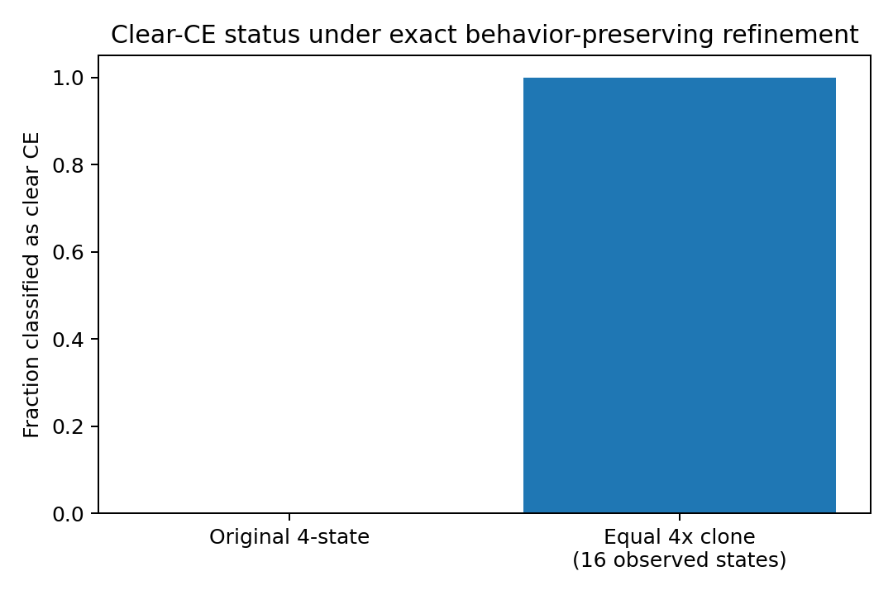
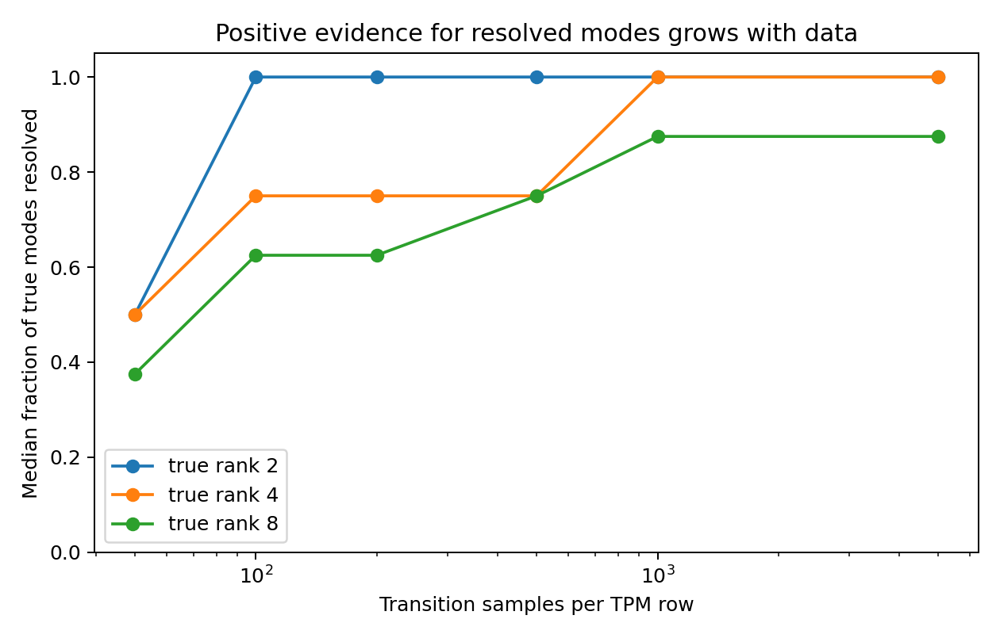
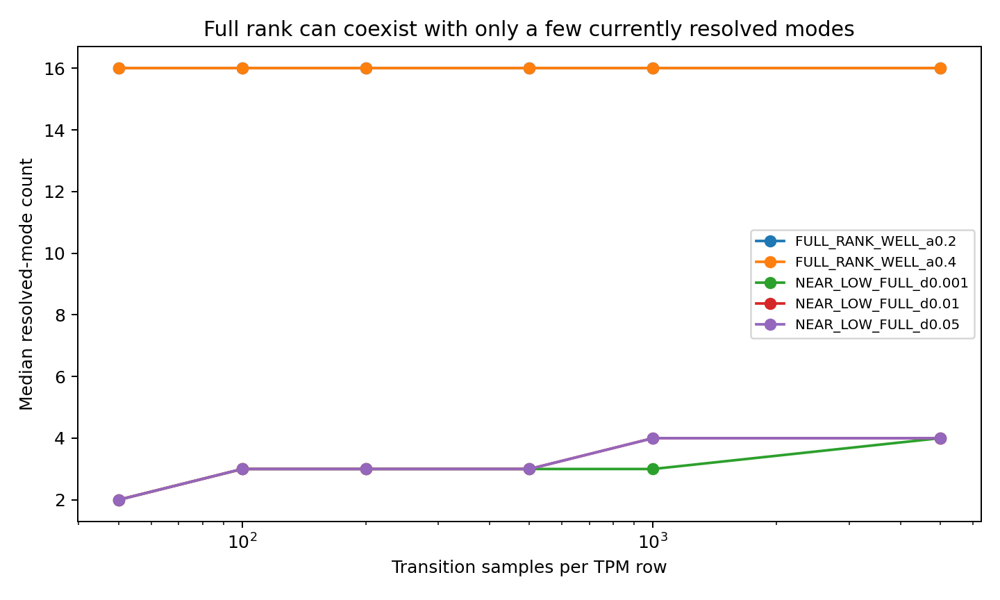
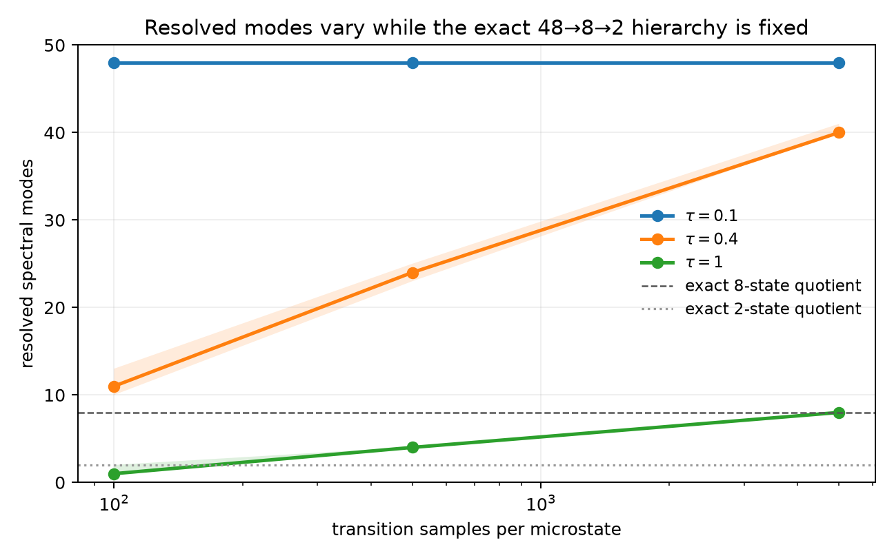

# Finite-Data Stress Tests for Spectral Causal Emergence

A reproducible benchmark for a narrow question:

> **What can finite transition data actually support about spectral/rank-based causal-emergence claims?**

This repository does **not** propose a new theory of causal emergence and does **not** claim to refute SVD-based causal emergence. It stress-tests the inferential step between an ideal transition probability matrix (TPM) and claims made from a TPM estimated with finite data.

The benchmark was motivated by the SVD-based framework of Zhang et al. (2025), where **clear causal emergence** occurs when `rank(P) < N` and **vague causal emergence** treats small singular values as approximately redundant.

## Interactive visualization

Explore the exact triadic geometry, its **48 → 8 → 2** hierarchy,
finite-sample resolved modes, and the isospectral control:

### [Open the Triadic Geometry Lab](https://sgarcia87.github.io/finite-data-causal-emergence-stress-test/)

## Main result

The experiments consistently support an **asymmetry of inference**:

> **Finite data can provide positive evidence that some dynamical modes are resolved more safely than they can provide negative evidence that weaker modes are absent.**

Accordingly, this repository distinguishes:

- **exact rank claims** — strong and fragile under finite sampling;
- **forced cutoff claims** — can overcompress when a method must choose a cutoff;
- **resolved-mode claims** — a conservative one-sided statement: *at least these modes are supported by the data*.
- **partition claims** — whether a specified aggregation is dynamically closed,
  which is not determined by spectral rank alone.
- **recovery claims** — whether an algorithm reproduces a known partition,
  which does not by itself certify exact dynamical closure.

## What survived the stress tests

### 1. Behavior-preserving refinement can change `clear CE`

For 150 random full-rank 4-state Markov chains, each state was replaced by four behaviorally identical clones.

The expanded 16-state chain is exactly lumpable back to the original chain:

- maximum lumping error: **0**
- median absolute change in Effective Information: **2.64e-16 bits**
- original chains classified as clear CE: **0 / 150**
- equally cloned representations classified as clear CE: **150 / 150**

The dynamics are operationally unchanged under the exact lumping, while the rank-based clear-CE status changes because `N` changes and the redundant refinement lowers `rank(P)/N`.

This is a **representation-sensitivity result**, not a claim that the refinement should or should not philosophically count as emergence.

### 2. Exact empirical rank is fragile under finite sampling

The population TPMs in the low-rank benchmark have exact algebraic ranks 2, 4, or 8, embedded in a 16-state observed space.

Yet finite multinomial estimation generically produces a full-rank empirical TPM. In the final benchmark, direct empirical `clear CE` detection is **0%** across the tested low-rank families at 100, 500, and 5,000 samples per row.

### 3. A cutoff locator is not a test that a meaningful cutoff exists

Three simple spectral baselines were included:

- largest log singular-value gap;
- linear scree elbow;
- a generic square-matrix SVHT baseline.

They are useful stress baselines, **not** presented as official procedures from Zhang et al. or as TPM-specific optimal estimators.

At 5,000 samples per row, exact-rank recovery aggregated over true ranks 2/4/8 was:

| Method | Exact-rank recovery |
|---|---:|
| largest log gap | 30.7% |
| linear scree elbow | 26.9% |
| generic SVHT baseline | 55.6% |

On the full-rank controls used here, these forced-compression rules selected an internal lower rank throughout the benchmark. This demonstrates a methodological point:

> A method that is required to locate a cutoff cannot, by itself, establish that a meaningful cutoff exists.

### 4. One-sided resolved-mode claims are more conservative

The benchmark includes an experimental cross-split diagnostic, `r_resolved`.

For repeated random splits of finite transition counts:

\[
D = \frac{\hat P_A-\hat P_B}{2}
\]

\[
G = \frac{\hat P_A^\top\hat P_B+\hat P_B^\top\hat P_A}{2}
\]

The split-discrepancy scale is:

\[
n = \lambda_{\max}(D^\top D)
\]

and an ordered mode is counted as **resolved** only when its lower split-quantile remains above this estimated noise floor.

The estimator makes only the one-sided claim:

\[
r_{\mathrm{true}} \ge r_{\mathrm{resolved}}
\]

It does **not** claim that unresolved modes are absent.

In this benchmark:

- `r_resolved` did not exceed the known algebraic rank in any tested family;
- the fraction of true low-rank structure resolved increased with sample size;
- near-low-rank but mathematically full-rank systems were reported as having only a few **resolved** modes, without being called exactly low rank.

At 5,000 samples per row, the median resolved fraction was:

| True algebraic rank | Median fraction resolved |
|---:|---:|
| 2 | 100% |
| 4 | 100% |
| 8 | 87.5% |

This is **not a formal confidence bound**. It is a benchmarked conservative diagnostic.

### 5. Triadic controls separate rank from macro-partition validity

A 48-state triadic system supplies exact partitions and symmetries that can be
checked independently of the spectrum. Three complementary controls show:

- an orthogonal rotation can preserve every singular value while breaking the
  exact closure of a designated eight-family partition;
- a full-rank heat-kernel TPM can admit the exact nested Markov hierarchy
  \(48\rightarrow8\rightarrow2\);
- `r_resolved` ranges from 1 to 48 as diffusion time and sample size change,
  while that exact hierarchy remains fixed;
- partition recovery, exact closure, and predictive usefulness can disagree,
  even when the requested number of groups is supplied.

These controls do not identify a unique preferred macroscale and do not claim
that exact lumpability is equivalent to causal emergence. See
[`docs/TRIADIC_CONTROLS.md`](docs/TRIADIC_CONTROLS.md).

### 6. Matched random partitions do not certify closure

Using the same triadic models, the designated eight-family partition was
compared with 2,000 balanced random partitions of identical group sizes. The
designated partition exceeded every sampled control in macro EI and closure
quality. However, the non-closed isospectral partition did so as well.

Within the random ensembles, higher EI was associated with worse closure
(Spearman correlations from -0.399 to -0.742). Thus, outperforming matched
random mappings demonstrates exceptional structure relative to that ensemble;
it does not certify exact closure or positive causal emergence. See
[`docs/EI_MATCHED_CONTROLS.md`](docs/EI_MATCHED_CONTROLS.md).

### 7. Exact recovery does not certify closure in an empirical codon model

The synthetic constructions are complemented by an external-data audit of the
restricted and unrestricted Empirical Codon Models of Kosiol, Holmes, and
Goldman (2007). These 61-state substitution models were estimated from
protein-coding sequence alignments rather than constructed by this repository.

Three biological partitions—16 first-two-base codon boxes (`B16`), 20 amino
acids (`AA20`), and 23 local translation blocks (`L23`)—had lower closure
residual than all 2,000 matched-size random partitions in both models at every
tested horizon. None closed exactly.

In the unrestricted ECM, cardinality-conditioned spectral clustering recovered
`AA20` exactly in all 30 seeded fits, while its closure residual remained
nonzero. Therefore,

\[
\boxed{\text{exact partition recovery}\not\Rightarrow\text{exact dynamic closure}.}
\]

The original ECM paper already identified amino-acid affiliation as a major
factor in codon evolution; the biological signal itself is not claimed as new.
See [`docs/EMPIRICAL_ECM_AUDIT.md`](docs/EMPIRICAL_ECM_AUDIT.md).

## Reproduce

Python 3.11+ is recommended.

```bash
git clone https://github.com/sgarcia87/finite-data-causal-emergence-stress-test.git
cd finite-data-causal-emergence-stress-test

python -m venv .venv
source .venv/bin/activate
pip install -r requirements.txt

python src/final_emergence_stress_benchmark.py
python scripts/make_figures.py

python src/triadic_partition_recovery.py --output results/triadic
python src/triadic_exact_hierarchy.py --output results/triadic
python src/triadic_blind_discovery.py --output results/triadic
python src/triadic_ei_matched_controls.py --output results/triadic
PYTHONPATH=src python -m unittest discover -s tests -p 'test_triadic_*.py'
python scripts/make_triadic_figure.py

python src/empirical_codon_audit.py \
  --source-dir data/empirical_ecm \
  --output results/empirical_ecm \
  --controls 2000 \
  --repeats 30 \
  --seed 20260915
PYTHONPATH=src python -m unittest -v tests/test_empirical_codon_audit.py
```

The main run regenerates the CSVs in the working directory. The committed `results/` directory contains the reference outputs used in this release.

## Repository layout

```text
.
├── README.md
├── LICENSE
├── requirements.txt
├── src/
│   ├── final_emergence_stress_benchmark.py
│   ├── triadic_partition_recovery.py
│   ├── triadic_exact_hierarchy.py
│   ├── triadic_blind_discovery.py
│   ├── triadic_ei_matched_controls.py
│   └── empirical_codon_audit.py
├── scripts/
│   ├── make_figures.py
│   └── make_triadic_figure.py
├── results/
│   ├── final_benchmark_representation_invariance.csv
│   ├── final_benchmark_all_results.csv
│   ├── final_benchmark_lowrank_summary.csv
│   ├── final_benchmark_fullrank_summary.csv
│   ├── final_benchmark_publication_endpoints.csv
│   ├── triadic/
│   └── empirical_ecm/
├── data/
│   └── empirical_ecm/
├── assets/
│   ├── fig1_representation_refinement.png
│   ├── fig2_lowrank_resolved_fraction.png
│   ├── fig3_fullrank_resolved_modes.png
│   └── fig4_triadic_resolved_modes.png
├── docs/
│   ├── METHODS.md
│   ├── RESULTS.md
│   ├── CLAIMS_AND_LIMITATIONS.md
│   ├── TRIADIC_CONTROLS.md
│   ├── EI_MATCHED_CONTROLS.md
│   ├── EMPIRICAL_ECM_PROTOCOL.md
│   └── EMPIRICAL_ECM_AUDIT.md
├── tests/
│   ├── test_triadic_*.py
│   └── test_empirical_codon_audit.py
├── archive/
│   └── EXPLORATORY_HISTORY.md
└── references.bib
```

## Figures

### Exact behavior-preserving refinement



### Resolved fraction in truly low-rank systems



### Resolved modes in full-rank systems



### Fixed exact hierarchy, varying resolved dimension



## Scope

The current benchmark is deliberately small and controlled:

- finite-state Markov chains;
- observed dimensions `N = 16` in the original benchmark and `N = 48` in the
  triadic controls, plus the 61-state empirical ECM audit;
- stratified row-wise transition sampling;
- synthetic ground truth in the original and triadic benchmarks;
- externally estimated average evolutionary parameters in the ECM audit, not
  raw molecular trajectories;
- no claim of universal optimality for `r_resolved`.

A strong next step would be a formal statistical treatment of resolved-mode lower bounds and an operational definition of when the unresolved spectral tail is negligible.

## Relation to recent SVD-based causal emergence

This repository is directly motivated by:

> Zhang, J., Tao, R., Leong, K. H., Yang, M., & Yuan, B. (2025). **Dynamical reversibility and a new theory of causal emergence based on SVD.** *npj Complexity*, 2, 3.  
> https://doi.org/10.1038/s44260-025-00028-0

That work defines clear CE through exact rank deficiency and vague CE through a singular-value threshold. This benchmark focuses on the **finite-data inference problem**: the population TPM is rarely known exactly.

A later extension of the SVD framework to Gaussian iterative systems is also relevant:

> Liu, K., Pan, L., Wang, Z., Yang, M., Yuan, B., & Zhang, J. (2025). **Singular-value-decomposition-based causal emergence for Gaussian iterative systems.** *Physical Review E*, 112, 054225.  
> https://doi.org/10.1103/mfct-sxn5

## What this repository does *not* claim

It does not claim that:

- SVD-based causal emergence is incorrect;
- Effective Information is invalid;
- `r_resolved` is a finished estimator of causal emergence;
- equal state cloning must be regarded as physically equivalent in every modeling context;
- spectral rank alone determines whether a macroscale is scientifically meaningful;
- exact lumpability implies positive causal emergence;
- a valid macro-partition is unique;
- the exploratory clustering baseline represents all discovery methods;
- exact recovery of a biological label partition establishes exact Markov
  closure or a unique causal macroscale;
- the ECM audit discovers a previously unknown biological organization of the
  genetic code.

The claim is narrower: **finite-data inference requires more caution than exact-TPM definitions alone reveal.**

## Status

**Research benchmark / technical note — v1.3**

The repository intentionally excludes exploratory results that failed later controls. See [`archive/EXPLORATORY_HISTORY.md`](archive/EXPLORATORY_HISTORY.md) for the methodological history.

## License

MIT License. See [`LICENSE`](LICENSE).
